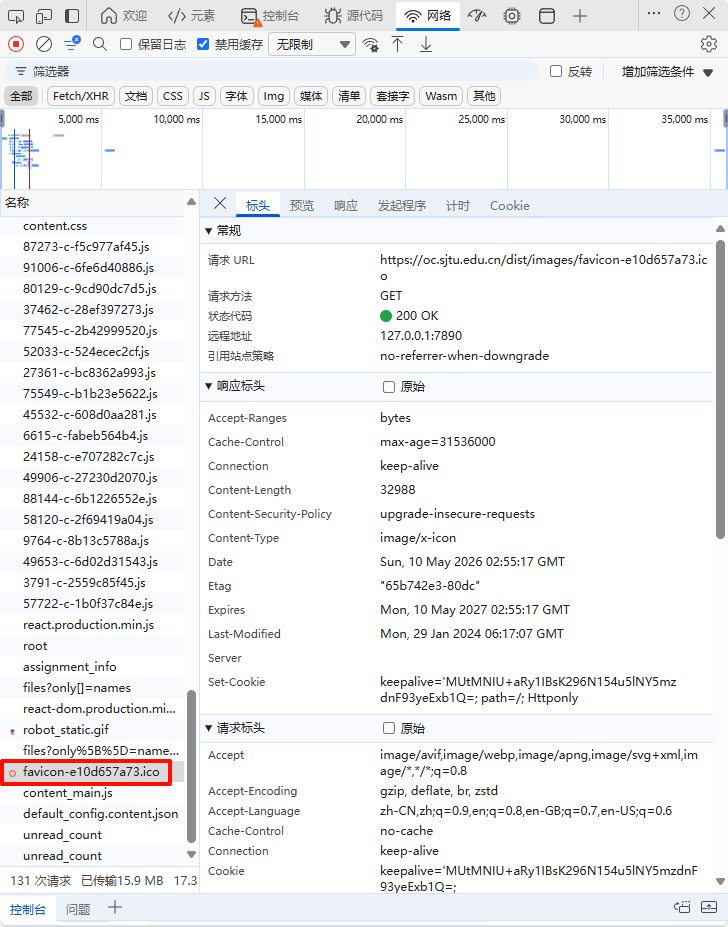

# SJTU Canvas Skill

这个 skill 面向上海交通大学 Canvas 平台用户，帮助你把 **课程文件（PPT/PDF）** 和 **课堂视频字幕** 自动整理成本地复习材料。它适合用于期末复习、补课、快速回顾某一讲内容，尤其适合不想完整回看视频、但希望知道“老师在视频哪一段讲了 PPT 上哪个知识点”的场景。

本 skill 提供了一些基本 cli 命令执行特定功能，例如列出课程、下载文件、获取字幕、生成复习上下文等。你可以使用这些命令来测试 Token 是否有效、获取的信息是否正确。但更好的使用方式是直接让 agent 来完成所有任务（这也是 skill 的设计初衷）。

---

## 0. 安装使用

当你已经拥有了一个 Agent (OpenClaw、Hermes、Codex 等)，你只需要发给它下面这段话即可：

```
安装 https://github.com/leinfinitr/sjtu-canvas-skill.git 这个 skill，并使用它来帮助我复习上海交通大学 Canvas 上的课程。
```

## 1. skill 提供的 cli 功能（Optional）

### 1.0 准备环境

```bash
git clone https://github.com/leinfinitr/sjtu-canvas-skill.git
cd sjtu-canvas-skill
uv sync
```

### 1.1 获取 Canvas 课程信息

查询你当前 Canvas 中的课程，例如：

```bash
uv run main --json list-courses
```

> 第一次执行时会需要你提供 Canvas API Token，成功后会把 Token 保存在本地 `.env` 文件里，后续执行时会自动使用。Token 的获取方法见 [4. 如何获取 Canvas API Token？](#4-如何获取-canvas-api-token)。

也可以查询某门课的课程文件：

```bash
uv run main --json list-files <course_id>
```

---

### 1.2 获取课堂视频列表

对于开启了“课堂视频”的课程，可以列出该课程的视频列表：

```bash
uv run main --json list-videos <course_id>
```

> 课堂视频功能需要 `OC_COOKIE`，它是从浏览器登录 Canvas 后复制的 Cookie，主要用于访问视频平台的登录态。获取方法见 [3. 如何获取 Cookie？](#3-如何获取-cookie)。

返回内容包括：

- 视频 ID
- 视频名称，例如 `算法设计与分析(研)(第28讲)`
- 上课时间

---

### 1.3 下载指定课堂视频的字幕

如果你知道课程 ID 和视频 ID，可以下载对应视频的平台字幕：

```bash
uv run main download-subtitle <course_id> \
  --video-id <video_id> \
  --out ./reviews
```

生成目录格式为：

```text
reviews/
  课程名/
    第N讲/
      transcript.txt
      metadata.json
```

例如：

```text
reviews/算法设计与分析/第28讲/transcript.txt
```

---

### 1.4 结合 PPT/PDF 和课堂字幕生成复习材料

使用 `study-note` 工作流只需要准备：

1. 一个课程工作目录；
2. `.env` 文件，里面保存 Canvas 登录 cookie；
3. 课程材料，例如 `hand15.pdf`、`lecture28.pptx`；
4. 目标视频 ID。

命令示例：

```bash
uv run main study-note <course_id> \
  --video-id <video_id> \
  --material "hand15.pdf" \
  --workspace /path/to/course-workspace
```

它会自动：

1. 从 workspace 的 `.env` 读取 cookie；
2. 获取对应视频字幕；
3. 在 workspace 中查找指定课程材料；
4. 抽取 PDF/PPT 中的文字；
5. 生成一个包含“课程材料 + 视频字幕”的复习上下文文件。

输出目录示例：

```text
course-workspace/
  reviews/
    算法设计与分析/
      第28讲/
        transcript.txt
        metadata.json
        study_note.md
```

其中：

- `transcript.txt`：视频字幕文本，带时间戳；
- `metadata.json`：视频元信息；
- `study_note.md`：结合课程材料和字幕的 agent-ready 复习上下文，适合进一步让 agent 总结成详细复习笔记。

---

## 2. 推荐目录结构

建议为每门课建一个单独的工作目录：

```text
~/courses/算法设计与分析/
  .env
  materials/
    hand15.pdf
    lecture28.pptx
  reviews/
```

`.env` 内容示例：

```bash
TOKEN="你的 Canvas API Token"
OC_COOKIE="你的 oc.sjtu.edu.cn Cookie"
```

你也可以只准备 `.env`，让 agent 从 Canvas 下载课程文件：

```text
~/courses/算法设计与分析/
  .env
```

然后告诉 agent：

> 请帮我下载算法设计与分析课程里的 hand15.pdf，并用它复习第25-28讲。

---

## 3. 如何获取 Cookie？

课堂视频功能依赖 Canvas 网页登录态，因此需要从浏览器复制 `oc.sjtu.edu.cn` 的 Cookie。

> ⚠️ Cookie 等价于临时登录凭证，请不要发到群聊或公开仓库。只建议保存在你自己的本地 `.env` 文件里。使用完成后，如果担心泄露，可以退出 Canvas / jAccount 或清除浏览器会话让 Cookie 失效。

### 3.1 使用 Chrome / Edge 获取 Cookie

1. 打开浏览器，访问：

   ```text
   https://oc.sjtu.edu.cn
   ```

2. 使用 jAccount 登录。

3. 进入任意 Canvas 课程页面，例如：

   ```text
   https://oc.sjtu.edu.cn/courses/<course_id>
   ```

4. 按 `F12` 打开开发者工具。

5. 切换到：

   ```text
   Network / 网络
   ```

6. 刷新页面。

7. 在 Network 请求列表里，点击一个发往 `oc.sjtu.edu.cn` 的请求，例如：

   ```text
   https://oc.sjtu.edu.cn/courses/xxxxx
   ```

> 最快的方法是查看 canvas icon 请求，例如 `。

8. 在右侧详情中进入：

   ```text
   Headers / 标头
   ```

9. 找到：

   ```text
   Request Headers / 请求标头
   ```

10. 复制其中的 `Cookie` 请求头。

你需要复制的是 `Cookie:` 后面的内容，不要复制 `Cookie:` 这几个字。

例如，如果浏览器显示：

```text
Cookie: a=1; b=2; c=3
```

你需要保存的是：

```text
a=1; b=2; c=3
```

---

### 3.2 保存到 `.env`

在课程工作目录下创建 `.env`：

```bash
mkdir -p ~/courses/算法设计与分析
cd ~/courses/算法设计与分析
nano .env
```

写入：

```bash
OC_COOKIE="a=1; b=2; c=3"
```

保存后即可让 skill 使用。

---

## 4. 如何获取 Canvas API Token？

Cookie 主要用于访问课堂视频 LTI 平台；Canvas API Token 主要用于标准 Canvas API，例如列出课程、列出课程文件、下载课程文件等。

> 在不使用 cli 的情况下 Cookie 就够了。

> ⚠️ Token 也是敏感凭证，请只保存在本地 `.env` 中，不要上传到公开仓库或发到群聊。

### 4.1 生成 Token

1. 登录 Canvas：

   ```text
   https://oc.sjtu.edu.cn
   ```

2. 点击左侧或右上角的：

   ```text
   Account / 账户
   ```

3. 进入：

   ```text
   Settings / 设置
   ```

4. 向下滚动，找到：

   ```text
   Approved Integrations / 允许融入使用的外部软件
   ```

5. 点击：

   ```text
   + New Access Token / + 创建新访问许可证
   ```

6. 填写用途，例如：

   ```text
   SJTU Canvas Review Agent
   ```

7. 可选：设置过期时间。

8. 点击生成后，立刻复制 Token。

> 注意：Canvas 通常只会显示一次完整 Token，离开页面后无法再次查看。如果忘记复制，只能重新生成。

### 4.2 保存到 `.env`

推荐把 Token 和 Cookie 都保存在课程 workspace 的 `.env` 中：

```bash
TOKEN="你的 Canvas API Token"
OC_COOKIE="你的 oc.sjtu.edu.cn Cookie"
```

完整目录示例：

```text
~/courses/算法设计与分析/
  .env
  materials/
  reviews/
```

### 4.3 验证 Token 是否可用

在 skill 仓库中运行：

```bash
uv run main --token "你的 Canvas API Token" --json list-courses
```

如果你已经把 `TOKEN` 放入当前项目或环境变量，也可以直接：

```bash
uv run main --json list-courses
```

成功时会返回课程列表 JSON。

---

## 5. 常用命令

### 5.1 列出课程

```bash
uv run main --json list-courses
```

### 5.2 列出某门课程的文件

```bash
uv run main --json list-files <course_id>
```

### 5.3 下载某个课程文件

```bash
uv run main download-file "<file_url>" --path /path/to/course-workspace/materials
```

### 5.4 列出课堂视频

```bash
uv run main --json list-videos <course_id>
```

### 5.5 下载某讲字幕

```bash
uv run main download-subtitle <course_id> \
  --video-id <video_id> \
  --out /path/to/course-workspace/reviews
```

### 5.6 生成复习上下文

```bash
uv run main study-note <course_id> \
  --video-id <video_id> \
  --material "hand15.pdf" \
  --workspace /path/to/course-workspace
```

---

## 6. Agent Usage

使用这个 skill 的核心价值在于让 agent 来自动完成从检查 Cookie、下载课程文件、获取字幕、生成复习资料等一系列操作。


**生成多节课综合复习材料**

> 请使用 SJTU Canvas skill 帮我复习算法设计与分析第25-28讲。这四节课使用的课件是 `hand15.pdf`，课程 workspace 是 `/home/liu/courses/算法设计与分析`。如果本地没有 `hand15.pdf`，请先从 Canvas 下载。然后分别获取第25、26、27、28讲的视频字幕，结合 `hand15.pdf` 和字幕，生成一份详细复习材料，要求包含：知识结构、关键定义、规约链路、每个知识点对应的 PPT 页码和视频时间戳、易错点、自测题。

以下是一些示例 prompt，展示了如何让 agent 来使用这个 skill 完成一些小任务。

---

### Demo 1：初始化课程工作目录

> 我想用 SJTU Canvas skill 复习算法设计与分析。我的课程工作目录是 `~/courses/算法设计与分析`，里面已经有 `.env` 保存了 OC_COOKIE。请检查这个 cookie 是否有效，并列出我当前 Canvas 课程。

---

### Demo 2：查看某门课有哪些视频

> 请使用 SJTU Canvas skill 查看算法设计与分析这门课的课堂视频列表。课程 ID 是 `90690`。请列出第25-28讲的视频 ID、标题和时间。

---

### Demo 3：下载课程资料

> 我的课程工作目录是 `~/courses/算法设计与分析`。我需要复习算法设计与分析第25-28讲，这几讲使用的课件是 `hand15.pdf`。如果这个文件不在本地，请从 Canvas 课程文件中查找并下载到 workspace 的 `materials/` 目录。

---

### Demo 4：生成单节课复习上下文

> 请使用 SJTU Canvas skill 为算法设计与分析第28讲生成复习上下文。课程 ID 是 `90690`，第28讲的视频 ID 是 `v0v0AvJXOZuuUQF3H96l4w==`，使用的材料是 `hand15.pdf`，workspace 是 `~/courses/算法设计与分析`。

agent 应该调用类似：

```bash
uv run main study-note 90690 \
  --video-id 'v0v0AvJXOZuuUQF3H96l4w==' \
  --material 'hand15.pdf' \
  --workspace ~/courses/算法设计与分析
```

### Demo 5：只获取字幕文本

> 请帮我获取算法设计与分析第28讲的视频字幕，并保存到本地。课程 ID 是 `90690`，视频 ID 是 `v0v0AvJXOZuuUQF3H96l4w==`，输出目录是 `~/courses/算法设计与分析/reviews`。

---

## 6. 常见问题

### Q1：为什么需要 Cookie，而不是只用 Canvas Token？

Canvas API token 可以访问课程、文件、作业等标准 Canvas API；但课堂视频是 SJTU Canvas 中的外部工具（LTI/OIDC），需要网页登录态才能进入视频平台。因此课堂视频和字幕功能需要 `OC_COOKIE`。

---

### Q2：Cookie 失效怎么办？

如果出现以下错误：

```text
未找到视频平台登录表单
未能从视频平台跳转中解析 tokenId
```

通常说明 Cookie 已过期或不是 `oc.sjtu.edu.cn` 的 Cookie。重新登录 Canvas 并复制新的 Cookie 即可。

---

### Q3：为什么某些课程没有视频？

可能原因：

- 课程没有开启“课堂视频”；
- 老师没有开放点播；
- 该课程是培训/体育等特殊课程，没有标准课堂视频；
- 视频平台返回结构不同，需要适配。

---

### Q4：为什么某些视频没有字幕？

可能原因：

- 平台没有生成字幕；
- 字幕接口暂时无数据；
- 视频太新，字幕尚未生成。

这种情况下可以后续使用 ASR fallback，从视频音频中转写字幕。

> ASR fallback 功能未完成开发与测试，欢迎贡献代码。

---

## 7. 免责声明 & 隐私与合规提醒

请遵守上海交通大学的相关政策和规定，合理使用 Canvas 平台提供的 API 和数据。由于未按规使用该 skill 导致的任何后果由用户自行承担。本仓库的开发初衷是在 Agent 时代帮助同学们更高效地利用 Canvas 课程资源进行学习和复习，而不是为了大规模下载或传播课程内容等不当用途。

以下是一些基本的使用原则：

- 课程视频和课件仅供个人学习使用；
- 不要把 Cookie、视频、字幕或课程文件上传到公开仓库；
- 不要将课程视频用于商业用途或公开传播；
- 如果担心 Cookie 泄露，请及时退出 jAccount/Canvas 或清除浏览器 Cookie。
